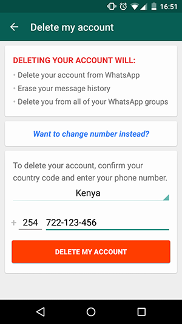

# Activate your account

####Step 1 : Get a Number

Your need a number from your preferred network or carrier. 

> ### Make sure that the number is not already in use on a WhatsApp enabled phone.

Using you own Whatsapp number on the Ongair platform will cause Whatsapp to stop working on your phone. We dont want that, get a number that your business can use.

if you want to use a number that is already on Whatsapp for your Ongair account go to settings and delete the account on your phone before registering on Ongair

####Step 2 : Activate your Number

To activate, the number you intend to use has to be on a phone that can receive an SMS or a CALL, this is only required for the set up process.

Once you are ready enter your preferred details in the form. Wait for the 6 digit code to be sent to your number.

Once you receive the code Complete the set up by Keying in the code.

Wait for a confirmation that your account is now active

#### Step 3 : Your account is ready

Your login details will be sent to the Email address you provided.